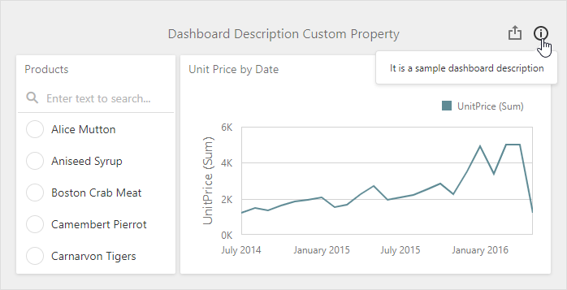

*Files to look at*:
- [Extensions](./CS/AspMvcDashboardCustomPropertiesSample/Content/Extensions)
- [Index.cshtml](./CS/AspMvcDashboardCustomPropertiesSample/Views/Home/Index.cshtml)

# ASP.NET MVC Dashboard - Custom Properties
<!-- run online -->
**[[Run Online]](https://codecentral.devexpress.com/253062639/)**
<!-- run online end -->

The following example shows how to create custom properties for the Web Dashboard.

## Overview

Custom properties are stored in the **CustomProperties** collection in a structured format. Each custom property of this collection contains the custom property's metadata.

To apply custom property values to a dashboard, you need to create an extension. The extension is a JavaScript module that you can integrate into your application. Every extension that provides custom property can be divided to the following parts:

1. Model.

    The model is an object that contains the property name, type, and a default value. It also specifies on which level the property is created (dashboard, dashboard item or data item container). Use the [Model.registerCustomProperty](https://docs.devexpress.com/Dashboard/js-DevExpress.Dashboard.Model.registerCustomProperty-1?v=20.1) property to register the custom property definition.

2. Viewer

    In this part you modify the viewer part according to the saved custom property value. You can use the client methods and events to change the displayed elements.

3. Designer

    This part contains designer settings. Add editors and control elements to configure and change the custom property's values in the UI. This part is not required if you use the extension in Viewer mode.

4. Event Subscription

    This part contains event subscriptions.

## Example structure

The following example contains a set of custom properties that demonstrate different capabilities. Below you find a detailed description for every extension.

> You can download the extension files from the following folder: [Extensions](/CS/AspMvcDashboardCustomPropertiesSample/Content/Extensions)

### ChartScaleBreaksExtension

This extension enables or disables scale breaks for the Chart dashboard item.

**Overview**:
- Adds a boolean custom property for a specific dashboard item (Chart).
- Integrates a _Scale breaks (Custom)_ section in the _Options_ menu with the [CheckBox](https://js.devexpress.com/DevExtreme/ApiReference/UI_Widgets/dxCheckBox/) widget as an editor.

### ChartLineOptionsExtension

This extension changes the dash style of the each series line in the Chart dashboard item.

**Overview**:
- Adds a string custom property for a specific data item container (Chart's series).
- Integrates a _Line Options (Custom)_ section in the data item menu with the [SelectBox](https://js.devexpress.com/DevExtreme/ApiReference/UI_Widgets/dxSelectBox/) widget as an editor.

### DashboardDescriptionExtension

This extension enables you to set a dashboard description in the dashboard menu. The dashboard description is displayed when you hover the info button in the dashboard title.

**Overview**:
- Adds a string custom property for a dashboard.
- Shows how to add a new item to the [ToolBox](https://docs.devexpress.com/Dashboard/117442/designer-and-viewer-applications/web-dashboard/ui-elements/toolbox?v=20.1). In this example, a new item is added to the [dashboard menu](https://docs.devexpress.com/Dashboard/117444/designer-and-viewer-applications/web-dashboard/ui-elements/dashboard-menu?v=20.1).
- Demonstrates how to create complex editors using templates. In this example, it is the  widgets with the [TextArea](https://js.devexpress.com/DevExtreme/ApiReference/UI_Widgets/dxTextArea/) and [Button](https://js.devexpress.com/DevExtreme/ApiReference/UI_Widgets/dxButtonGroup/) widgets inside.

### ItemDescriptionExtension

This extension enables you to set a description for each dashboard item. The dashboard item description is displayed when you hover the info button in the item's caption.

Overview:
- Adds a string custom property for each dashboard item.
- Integrates a _Description (Custom)_ section in the _Options_ menu with the predefined [buttonGroup](https://docs.devexpress.com/Dashboard/js-DevExpress.Dashboard.Designer.FormItemTemplates?v=20.1#js_devexpress_dashboard_designer_formitemtemplates_buttongroup_static) template.
- Shows how to change an editor's disabled state depending on a custom property's value.

### ChartAxisMaxValueExtension

This extension enables you to change the Chart's Y-axis maximum value.

Overview:
- Adds a set of custom properties with [different types](https://docs.devexpress.com/Dashboard/js-DevExpress.Dashboard.Model.CustomPropertyMetadata?v=20.1#js_devexpress_dashboard_model_custompropertymetadata_valuetype) (number, boolean, and string) for a specific dashboard item (Chart).
- Demonstrates how to bind a custom property to a list of data items.
- Shows how to change editors' disabled state depending on a custom property's value.

### ChartConstantLinesExtension

This extension draws constant lines for the Chart dashboard item.

Overview:
- Adds a complex custom property for a specific dashboard item (Chart).
- Shows how to work with complex custom values that are saved as an array.
- Demonstrates how to bind a custom property to a list of data items.
- Customizes export to display the result in the exported document.

## See Also

- [Client-Side Customization](https://docs.devexpress.com/Dashboard/401701/designer-and-viewer-applications/web-dashboard/client-side-customization?v=20.1)
- [Custom properties](https://docs.devexpress.com/Dashboard/401702/designer-and-viewer-applications/web-dashboard/client-side-customization/custom-properties?v=20.1)
